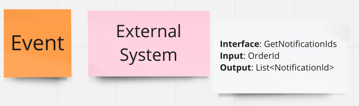
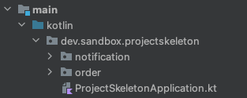
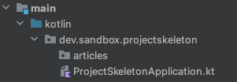
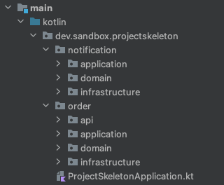

# Project-Skeleton

Niniejszy artykuł ma na celu przedstawienie jak krok po kroku przygotować szkielet aplikacji czyli jej fundament. 
Do artykułu dołączony jest przykładowy zalążek nowego projektu wraz z testami architektury weryfikującymi przyjęte konwencje.

#### Table of contents

1. [Wstęp](#wstęp)
2. [Czy faktycznie mamy wszystko](#czy-faktycznie-mamy-wszystko)
3. [Nazwa usługi](#nazwa-usługi)
4. [Project kick-off](#project-kick-off)
5. [Szkielet Aplikacji](#szkielet-aplikacji)  
   5.1 [Podział biznesowy](#podział-biznesowy)  
   5.2 [Podział techniczny](#podział-techniczny)  
   5.3 [Use Case](#use-case)  
   5.4 [Spring Configuration](#spring-configuration)
6. [Podsumowanie](#podsumowanie)

## Wstęp

Przy wykorzystaniu techniki Event Storming udało się zmapować cały proces biznesowy oraz wyznaczyć granicę modułów/bounded contextów.
Wszystkie niejasności/wątpliwości/ryzyka w postaci hot spotów zostały zaadresowane.
Modelowany proces jest zrozumiały dla wszystkich członków zespołu.
Karteczki z sesji stormingowej udało się sprawnie przełożyć na zadania.
Czujemy, że mamy 100% pewności co i jak trzeba zrobić.

Pytanie, jak się do tego zabrać? Od czego rozpocząć prace, aby była ona efektywna?

## Czy faktycznie mamy wszystko?

W przypadku kiedy modelowany proces wymaga integracji z dużą ilością zewnętrznych usług, z których pobierane są dane potencjalna niewiedza (hot spots) może kryć się właśnie na styku integracji z tymi usługami. Może się okazać, że nie mamy wystarczającej ilości danych aby odpytać dany serwis albo nie do końca jest jasne co należy z niego pobrać.

Odpytując serwis o dane warto zadać sobie następujące pytania:
- Jakich danych potrzebuję, aby wykonać zapytanie, czyli jaki jest INPUT
- Jakie dane pobieram, czyli jaki jest OUTPUT

Ta dodatkowa czynność pozwoli upewnić się, że zarówno cel integracji, jak i jego szczegóły techniczne są jasno zdefiniowane.
Dzięki czemu jesteśmy w stanie wyeliminować potencjalne problemy/niepodpowiedzenia, które pojawiłyby się dopiero w fazie developmentu.

Warto notować takie rzeczy w formie notatki/komentarza przy integracji z każdym zewnętrznym systemem.
Jeżeli integracja jest ‘ciężka’ szczegóły integracji można umieścić w dedykowanym dokumencie a na miro zanotować tylko informację o obiekcie wejściowym, wyjściowym oraz nazwie interfejsu.
Nazwa interfejsu powinna oddawać ‘intencję komunikacyjną’ która stoi za daną integracją. Unikajmy zbyt ogólnych albo technicznych nazw.

Inne potencjalne ryzyka (hot spoty), na które warto zwrócić uwagę przy integracji z innymi usługami:
- Czy usługa, z która się integrujemy jest gotowa na ruch, który będziemy generować?
- Jakie są czasy odpowiedzi?
- Czy dane są aktualne, czy pochodzą z cache?
- Czy jest wymagana dodatkowa autoryzacja?

## Nazwa usługi

Rozpoczynając nową inicjatywę możemy nadać jej roboczą, tymczasową nazwę.
Jednak przychodzi w końcu moment, w którym trzeba się zdecydować na jakąś konkretną nazwę.
Najlepiej taką decyzję podjąć wspólnie z zespołem.
Nazwa aplikacji pojawia się w wielu miejscach i może być bardzo trudna do zmiany w późniejszym czasie.

## Project kick-off

Mając nazwę aplikacji możemy wystartować z następującymi rzeczami:
- Przygotowanie pustego projektu w wybranej technologi.
- Założenie repozytoriów (aplikacja, konfiguracja, monitoring)
- Build
- Observability

Są to standardowe rzeczy, które należy zrobić dla każdego projektu.
Warto o nie zadbać na samym początku. Pusty projekt powinno dać się wdrążyć na wszystkie środowiska a jego działanie zweryfikować (logi, metryki).
Unikniemy dzięki temu sytuacji, w której nasze zadania kończą się domergowaniem czegoś do głównego brancha bez weryfikacji na środowiskach czy faktycznie działają.

## Szkielet Aplikacji

Brak początkowej struktury projektu przed startem developmentu spowoduje, że strukturę taką narzuci pierwszy commit, który ‘wejdzie’ do głównego brancha.
Może to prowadzić do problemów natury technicznej oraz organizacyjnej.

Jeżeli równolegle zaczęliśmy pracę nad kilkoma zadaniami to podczas wystawiania PR'ów trzeba będzie poświęcić czas, aby dostosować je do tego co już zdążyło pojawić się na głównym branchu.
Próba zmiany aktualnej struktury projektu może z kolei prowadzić do dyskusji co blokuje development i wprowadza chaos.

Co powinien zatem zawierać dobry szkielet aplikacji?

### Podział biznesowy

Struktura projektu w pierwszej kolejności powinna odzwierciedlać modelowaną domenę ([Domain-based structure](https://dannorth.net/2022/02/10/cupid-for-joyful-coding/#domain-based-structure), [Screaming Architecture](https://blog.cleancoder.com/uncle-bob/2011/09/30/Screaming-Architecture.html)).

Wyznaczone na Event Stormingu granice bounded contextów powinniśmy przedstawić w kodzie za pomocą odpowiednich pakietów.
Następnie relacje między tymi pakietami opisać za pomocą testów architektury ([ArchUnit](https://www.archunit.org/)), które będą nas chronić przed niechcianymi zależnościami na poziomie kompilacji.

W początkowej fazie projektu podejście, w którym wykorzystujemy pakiety oraz testy architektury do nadania kształtu naszej aplikacji jest zdecydowanie lepsze niż używanie do tego celu modułów mavenowych/gradlowych. Refactoring w przypadku pakietów jest zdecydowanie szybszy i prostszy.

Co w przypadku kiedy mamy jeden bounded context?
Pokażmy go! Najlepiej zrobić to poprzez umieszczenie klasy z funkcją **main** na tym samym poziomie co pakiet z naszym Bounded Context.

Podział domenowy można kontynuować dalej w obrębie każdego BC.

Na każdym etapie trwania projektu warto poddawać ocenie aktualny podział biznesowy.
To, co było dobre w pierwszym roku developmentu, po dodaniu kilku nowych funkcjonalności może okazać się niewystarczające.
Struktura domenowa projektu powinna ewoluować wraz z rozwojem projektu.

Testy architektury dla podziału domenowego: [BoundedContextTest](src/test/kotlin/dev/sandbox/projectskeleton/archunit/BoundedContextTest.kt)

Przykłady projektów w oparciu o domain-based structure:
- [ddd-example-ecommerce](https://github.com/ttulka/ddd-example-ecommerce)
- [library](https://github.com/ddd-by-examples/library)

### Podział techniczny

Mając podział domenowy przechodzimy do podziału technicznego w obrębie modułów/bounded contextów.
Podział techniczny będzie wypadkową użytej architektury oraz standardów kodowania przyjętych przez dany zespół.
Osobiście preferuję układ, w którym wyróżniamy 3 główne pakiety:
- **application** 
  Warstwa serwisów aplikacyjnych. 
  Orkiestruje obiekty z warstwy domain tworząc procesy (Use Case). 
  Zapewnia tranzakcyjność (jeżeli jest wymagana). 
  Testujemy integracyjnie. 

- **domain** 
  Foremki naszej domeny: agregaty, encje, value objects, eventy, fabryki, polityki oraz interfejsy do komunikacji ze światem zewnętrznym. 
  Nie używamy w domain spring framework. 
  Ograniczamy użycie typów prymitywnych na rzecz value objects. 
  Testujemy wyłącznie jednostkowo. 

- **infrastructure** 
  Dostęp do bazy danych, komunikacja z zewnętrznymi usługami. 
  Implementuje kontrakty komunikacyjne opisane przez warstwę domain (porty). 
  Zawiera konfigurację springową.  
  Testujemy integracyjnie. 

Jeżeli zachodzi potrzeba wystawienia REST-owego endpointu należy umieścić go w osobnym pakiecie (api/web/rest)

Zależności między pakietami technicznymi należy opisać za pomocą testów architektury.
Testy takie wystarczy napisać raz i re-używać między projektami, które wykorzystują tę samą architekturę i konwencje.
Testy architektury, które będziemy pisać dla podziału biznesowego (domenowego) będą z kolei unikalne dla danego projektu.

Testy architektury dla podziału technicznego: 
* [HexagonalArchitectureTest](src/test/kotlin/dev/sandbox/projectskeleton/archunit/HexagonalArchitectureTest.kt)
* [CodingRulesTest](src/test/kotlin/dev/sandbox/projectskeleton/archunit/CodingRulesTest.kt)

### Use Case

W obrębie każdego modułu/bounded contextu należy przygotować klasę, która będzie orkiestrowała proces biznesowy (serwis aplikacyjny) i umieśćmy ją w pakiecie application.
Jest to miejsce, w które będziemy ‘wpinać’ kolejne wywołania usług i serwisów domenowych, które finalnie będą składać się na dany proces.
Nazwa takiej klasy powinna być bardzo precyzyjna i odwzorowywać implementowany proces.
Unikajmy konwencji rzeczownik + Service (np: ArticlesService).
Brak precyzji w nazewnictwie to jeden z głównych powodów dla których klasy rozrastają się do ogromnych rozmiarów.

### Spring Configuration

Każdy boundex context naszej aplikacji powinien zawierać plik z konfiguracją springową, która powinna znajdować się w pakiecie infrastructure.
Zalecana konwencja nazewnicza Bounded Context Name + Configuration (np: NotificationConfiguration).

Ograniczenie użycia component scanu oraz rezygnacja z użycia annotacji @Component (oraz jej pochodnych) na rzecz konfiguracji pisanej explicite w plikach konfiguracyjnych @Configuration prowadzi do bardziej świadomego zarządzania zależnościami między poszczególnymi komponentami oraz odseparowania klas w pakiecie domain od spring framework.

W przypadku kiedy mam więcej niż jeden boundex context to zależności między BC należy umieszczać w konstruktorach klas konfiguracyjnych. Pozwala to wykryć pojawienie się zależności cyklicznych między bounded contexami - co świadczy o dużych problemach w designie.

## Podsumowanie

Zanim przejdziemy do implementacji poszczególnych zadań warto poświęcić czas, aby przygotować sobie odpowiednie warunki do ich realizacji.
Decyzję, o których pisałem powyżej i tak trzeba będzie kiedyś podjąć.
Lepiej dla projektu i developerów zrobić to świadomie na samym początku projektu, kiedy nie powstała jeszcze żadna linijka kodu produkcyjnego.

Projekt przygotowany według powyższych zaleceń znajduje się w **src** repozytorium. 

